# Password Generator Starter Code

AS AN employee with access to sensitive data
I WANT to randomly generate a password that meets certain criteria
SO THAT I can create a strong password that provides greater security

# GIVEN I need a new, secure password
    - Once loaded the website presents with a title "Password Generator", a secondary header "Generate a Password", a box with text that reads "Your Secure Password" then a button labeled "Generate Password". Once the Generate Password button is selected it will lead you through a series of questions that will decide the criteria of your password. This includes letters by default, so they will have some password if they say no to all. Questions include length, characters (Yes/No), upper case letters (Yes/No) and Numbers (Yes/No). In the end, once all questions have been exhausted a new password will be shown in the box.

## WHEN I click the button to generate a password
## THEN I am presented with a series of prompts for password criteria
    - Questions again include length, characters, upper case letters, numbers.

## WHEN prompted for password criteria
## THEN I select which criteria to include in the password
    - As stated above the criteria is asked throughout the prompts, this will determine if you want these different items or not.

## WHEN prompted for the length of the password
## THEN I choose a length of at least 8 characters and no more than 128 characters
    - The first question is how long you would like the password. You need to choose between 8 and 128 characters. If you don't select a valid number it will keep looping until you select a correct answer.

## WHEN prompted for character types to include in the password
## THEN I choose lower case, upper case, numeric, and/or special characters
    - All of these are options, the only acception is lower case. By default, lower case letters will always be included so the user will be guranteed to have a baseline password.

## WHEN I answer each prompt
## THEN my input should be validated and at least one character type should be selected
    - When selecting items, validations are as follows. When choosing a number, if you don't select a number between 8 and 128 it will let you know this is invalid and to choose another number that is within range. When selecting for the (Yes/No) questions if you select yes you proceed, however if you select no, it will verify you don't want to have this on your password, if you decide you actually do then you select cancel and it will allow you to select again.

## WHEN all prompts are answered
## THEN a password is generated that matches the selected criteria
    - After all of the criteria is answered, a new password will be displayed exactly to the criteria you set by answering the questions.

## WHEN the password is generated
## THEN the password is either displayed in an alert or written to the page
    - The password appears on the page inside the box above Generate Password. If you were to select Generate Password again it would loop to the beginning and start over and allow you to create a new password.

    
# Password Generator Function (With Screenshots)

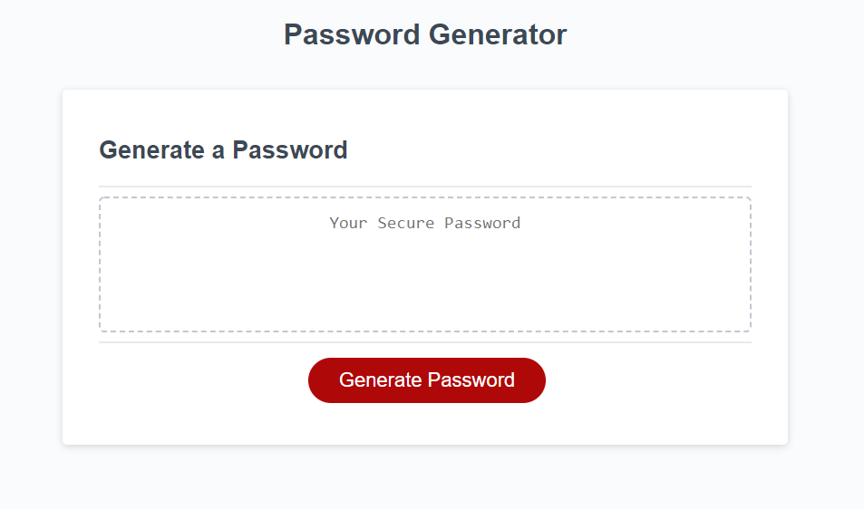
    - First you are greeted with a page with title, sub title, a box (where password will go) with text inside "Your Secure Password". And last there is a red button with "Generate Password" that once clicked will prompt you to start making a password.

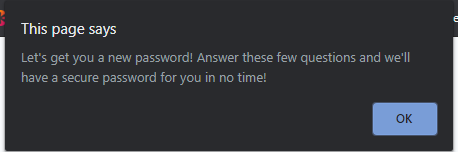
    - Once the "Generate Password" button has been selected you are greeted with a prompt that informs the user that after a few questions we will "have a secure password for you in no time!". Once OK is selected the prompts continue.

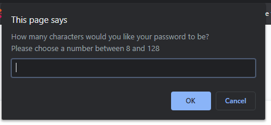
    - One you select ok you move onto the length of password. It asks you to choose a number between 8 and 128. If you select OK you move onto the next prompt if you select cancel you are greeted with a verify selection prompt as showin in the next shot.

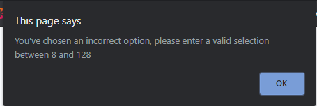
    - If you choose a number that is not between 8 and 128 and/or you don't choose an option at all you are greeted with this prompt that states "You've chosen an incorrect option". Once you select OK it will lead you back to the length of password prompt once again. This loop will continue until a correct number between 8 and 128 is chosen.

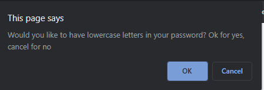
    - Next once the correct length is chosen you then move onto a prompt that asks if you want lower case letters in your password. If accepted you move onto the next criteria selection, if you select no/Cancel then it takes you to another prompt.

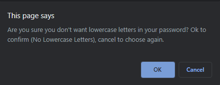
    - If you select no/Cancel then you are greeted with a prompt that verifies you don't want to have lower case letters in your password. If you select yes/OK then the next criteria prompt is opened. If you select no/Cancel then it will take you back to the lower case letters select prompt.

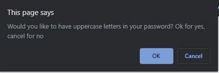
    - After the lowercase letters prompt has been exhausted then we move onto the upper case letters prompt. It asks if you would like upper case letters in your password. If you select yes/OK you move onto the next prompt about numbers. 

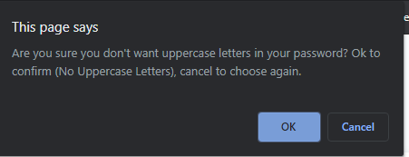
    - If you choose no/Cancel to the upper case letters prompt you are met with a message asking if you're sure you don't want upper case letters in your password. If you select yes/OK you will move onto numbers prompt. If you select no/Cancel you will then go back to the upper case original prompt and be able to select if you want upper case letters again.

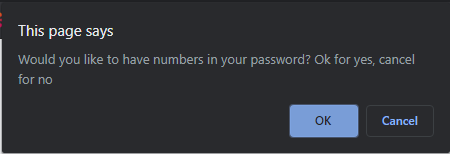
    - Next criteria you choose from is whether to have numbers (0-9) in your password. As with the one above if you select yes/OK then it moves on to next criteria. If no/Cancel is selected you are met with a new prompt.

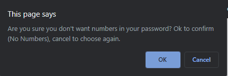
    - If you choose no/Cancel then you are met with a prompt verifying that you don't want numbers in your password. If you then choose yes/OK you will continue to the next prompt with the next criteria. If you select no/Cancel then you will go back to the original numbers prompt and be able to choose again.

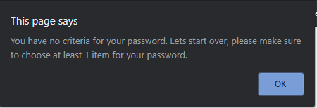
    - If you were to choose no/Cancel to all options (Not including length prompt which you can't select nothing/null) then you will be met with this prompt that informs the user that they have "no criteria" for their password. Once OK is selected they will start over from the length prompt.

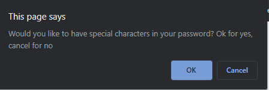
    - Once you choose whether or not you would like to have numbers in your password you move onto a prompt asking if you want special characters in your password. If you select yes/OK you will receive your password in the box below "Generate a Password". If you'd like to start again and choose a new password all you need to do it select the red "Generate Password" button again.

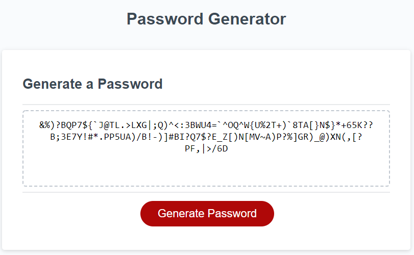
    - After all prompts have been properly answered and taking into account length a password is generated. Again, if the user wants to choose a new password they can select the red "Generate Password" button to start the process over.

